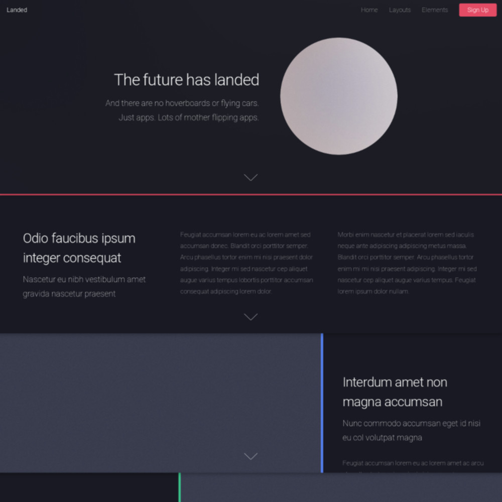

# Landed Theme

The **Landed** Theme is for [Grav CMS](http://github.com/getgrav/grav). It's a port of [Landed](https://html5up.net/landed) by HTML5 UP under its [CCA 3.0 license](https://html5up.net/license).



# Installation

Installing the Landed theme can be done in one of two ways. Our GPM (Grav Package Manager) installation method enables you to quickly and easily install the theme with a simple terminal command, while the manual method enables you to do so via a zip file.

## GPM Installation (Preferred)

The simplest way to install this theme is via the [Grav Package Manager (GPM)](http://learn.getgrav.org/advanced/grav-gpm) through your system's Terminal (also called the command line).  From the root of your Grav install type:

    bin/gpm install landed

This will install the Landed theme into your `/user/themes` directory within Grav. Its files can be found under `/your/site/grav/user/themes/landed`.

>> This method will copy the sample pages provided in the `_demo/pages` folder to your `user/pages` folder so that the theme will work out of the box with placeholder content. The content is the same _Ipsum lorem_ content provided in the original [HTML5 UP theme](https://html5up.net/landed).

## Manual Installation

To install this theme, just download the zip version of this repository and unzip it under `/your/site/grav/user/themes`. Then, rename the folder to `landed`. You can find these files either on [GitHub](https://github.com/hughbris/grav-theme-landed) or via [GetGrav.org](http://getgrav.org/downloads/themes).

You should now have all the theme files under

    /your/site/grav/user/themes/landed

>> NOTE: If you want to use and adapt the default _Ipsum lorem_ content provided with the original theme, move the contents of `_demo/pages` into your grav installations's `user/pages` directory. This will ensure that the theme templates work out of the box.

# Updating

As development for the Landed theme continues, new versions may become available that add additional features and functionality, improve compatibility with newer Grav releases, and generally provide a better user experience. Updating Landed is easy, and can be done through Grav's GPM system, as well as manually.

## GPM Update (Preferred)

The simplest way to update this theme is via the [Grav Package Manager (GPM)](http://learn.getgrav.org/advanced/grav-gpm). You can do this with this by navigating to the root directory of your Grav install using your system's Terminal (also called command line) and typing the following:

    bin/gpm update landed

This command will check your Grav install to see if your Landed theme is due for an update. If a newer release is found, you will be asked whether or not you wish to update. To continue, type `y` and hit enter. The theme will automatically update and clear Grav's cache.

## Manual Update

Manually updating Landed is pretty simple. Here is what you will need to do to get this done:

* Delete the `your/site/user/themes/landed` directory.
* Download the new version of the Landed theme from either [GitHub](https://github.com/hughbris/grav-plugin-landed) or [GetGrav.org](http://getgrav.org/downloads/themes#extras).
* Unzip the zip file in `your/site/user/landed` and rename the resulting folder to `landed`.
* Clear the Grav cache. The simplest way to do this is by going to the root Grav directory in terminal and typing `bin/grav clear-cache`.

> Note: Any changes you have made to any of the files listed under this directory will also be removed and replaced by the new set. Any files located elsewhere (for example a YAML settings file placed in `user/config/themes`) will remain intact.

# Setup

If you want to set Landed as the default theme, you can do so by following these steps:

* Navigate to `/your/site/grav/user/config`.
* Open the **system.yaml** file.
* Change the `theme:` setting to `theme: landed`.
* Save your changes.
* Clear the Grav cache. The simplest way to do this is by going to the root Grav directory in Terminal and typing `bin/grav clear-cache`.

Once this is done, you should be able to see the new theme on the frontend. Keep in mind any customizations made to the previous theme will not be reflected as all of the theme and templating information is now being pulled from the **landed** folder.

# Usage

## Supported Page Templates

* [Sample homepage view template](templates/home.html.twig)
* [Left sidebar two-column template](templates/left-sidebar.html.twig)
* [Right sidebar two-column template](templates/right-sidebar.html.twig)
* [Single column template](templates/default.html.twig)
* Barely distinct [Error page template](templates/error.html.twig)

## Deferred assets block support

As [explained in the Grav blog](https://getgrav.org/blog/important-theme-updates), since Grav 1.5.10 deferred blocks are supported and it will be standard to invoke assets rendering using these in the near future. _For the page templates included_, **this theme does not require deferred asset blocks**, and including a deferred asset block will crash a site running an older version of Grav.

Since v0.1.2 of this theme, it is simple to override the base template so that you can use a deferred asset block. In a template that extends `partials/base.html.twig`, simply add a deferred block called `assets`. For example:

```twig


{# for example, add a custom javascript file #}

  {% do assets.addJs('theme://js/site.js') }}
  {{ parent() }}


{# then override the default non-deferred assets block with a deferred block, and optionally alter it #}

  {{ parent() }}

```

If several of your templates require a deferred asset block, either:

* create a common shared partial template, say `partials/extended-base.html.twig` with similar contents to the example above, and change your template files so that they extend this rather than `partials/base.html.twig`; _or_
* modify a copy of `partials/base.html.twig`.

If several of your templates require a deferred asset block, create a common shared partial template, say `partials/extended-base.html.twig` with similar contents to the example above, and change your template files so that they extend this rather than `partials/base.html.twig`.

## Menu Features

### Dropdown Menu

You can enable **dropdown menu** support by enabling it in the `landed.yaml` configuration file. As per usual, copy this file to your `user/config/themes/` folder (create if required) and edit there.

```
dropdown:
  enabled: true
```

This will ensure that sub-pages show up as sub-menus in the navigation.

### Menu Text

Each page shows up in the menu using the title by default, however you can set what displays in the menu directly by setting an explicit `menu:` option in the page header:

```
menu: My Menu
```

### Custom Menu Items

By default, Grav generates the menu from the page structure.  However, there are times when you may want to add custom menu items to the end of the menu.  This is now supported in Landed by creating a menu list in your `site.yaml` file.  An example of this is as follows:

```
menu:
    - url: https://github.com/hughbris/grav-theme-landed
      text: Source
    - url: 'https://example.org/landed-signup'
      text: 'Sign Up'
      classes: 'button primary'
```

The `url:` and `text:` options are required.

If you supply a `classes:` option, those are added to the menu link classes. This is a new option added for the Landed theme.

## Examples in the wild

None that I know of yet! Please let me know if you are using it (hey, it's free publicity).

I am slowly building a site using this template.

I have also deployed a [live demo for the theme](https://behold.metamotive.co.nz/landed) which usually runs the latest release.